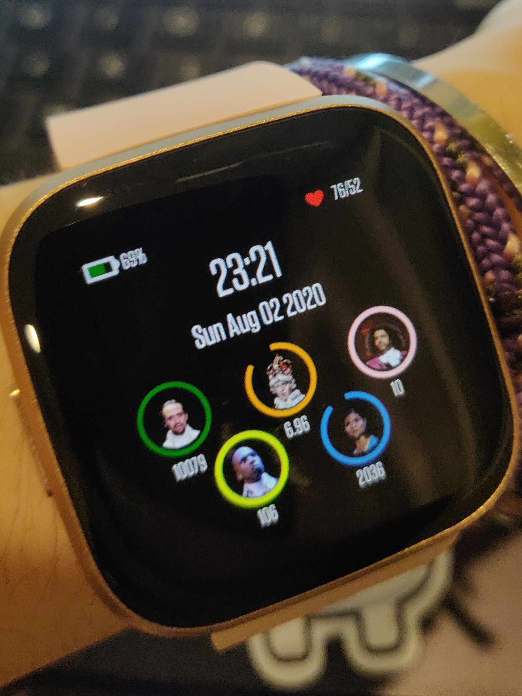

# Hamilton-Fitbit-Clockface

  

The Hamilton musical inspired Fitbit clockface includes:
* battery indicator
* current heart rate over resting heart rate
* time and date
* steps
* distance
* elevation gain
* active minutes
* calories burned

As the user gets closer to reaching a specific activity goal, that ring will fill up and the character in the middle will become more clear (underneath the characters are the icons for the specified activity).

The Hamilton characters (pictures of the original cast were used) were assigned to the following activities:
* Hamilton is steps taken because he is non-stop
* King George is distance travelled because he rules America from far away
* Jefferson is elevation gain because he manages to rise to the top by the end of the musical
* Burr is active minutes because he waits for it
* Eliza is calories burnt because she lets it burn

This clockface is built for the Fitbit Versa series and requires permission to view user activity, user profile, and heart rate.
